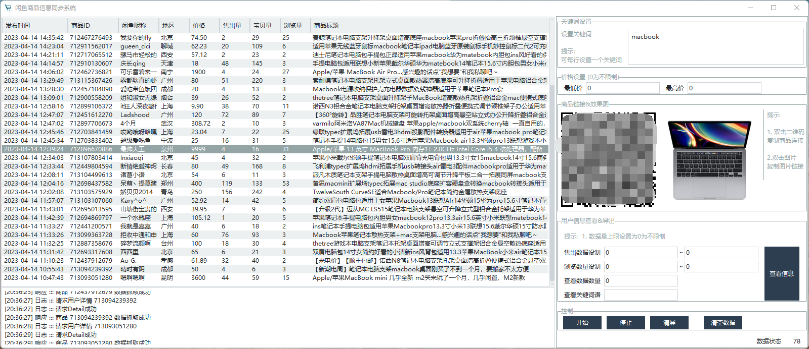

# idlefishDetail
闲鱼商品详情抓取系统升级/测试完毕，可自动采集闲鱼商品详情信息

升级了上次发布的《闲鱼商品详情抓取系统》，抓取数据包括且不限于闲鱼发布时间、用户昵称、发布地区、价格、在售商品数量、销量、想要人数、浏览量、商品描述等信息。

目前的功能效果如下图：

系统介绍：

1、可根据关键词自动搜索闲鱼商品，并自动加载并采集商品详情页数据。

2、可谨慎采集用户信息（包括销售数据，在售数据等用户信息，必要时可采集用户登录、发布IP等公开信息，用于判断用户行为）。

3、其他功能，在法律允许，不踩红线，做为自动化工具使用的前提下，基本都可以实现。
